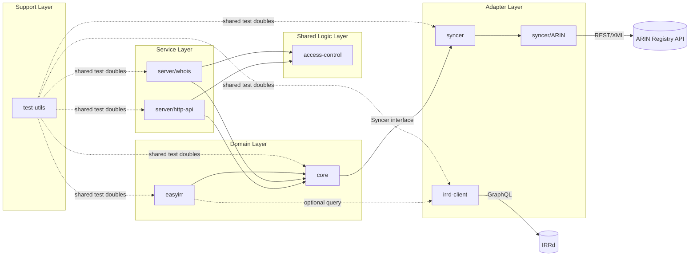

# Mitei Architecture

## Overview

This document summarizes module interactions in the Mitei codebase.
The diagram is optimized for coding agents to quickly locate change impact.

## Practical Notes For Agents

- Core changes usually affect both HTTP and WHOIS behavior.
- Sync behavior changes usually touch both core and syncer/ARIN.
- EasyIRR parsing or expansion changes may involve irrd-client.
- For authorization and resource rules, focus in src/access-control first.
- For token verification and HTTP auth integration, focus in server/http-api/auth.

## Fast Entry Paths

- IRR object logic: src/core/IRR/AS_SET, src/core/IRR/manager
- Sync pipeline: src/core/index.ts, src/syncer/types.ts, src/syncer/ARIN/arin-client.ts
- Authorization core: src/access-control
- HTTP auth integration: src/server/http-api/auth, src/server/http-api/user
- WHOIS query behavior: src/server/whois/index.ts
